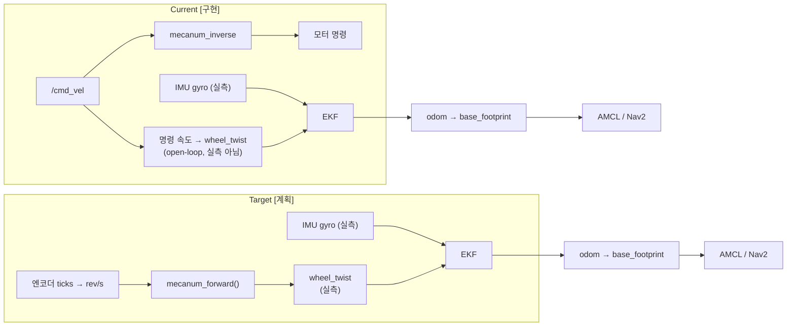

# Architecture

표기: **[구현]** 실기 동작 확인, **[부분]** 코드/일부 검증, **[계획]** 아직 없음. 근거는 `AGENTS.md`의 "확정된 사실"과 `checklist/`.

## 1. 계층 구조

```mermaid
flowchart TB
  subgraph APP["Application [계획]"]
    V[Voice / HMI] --> M[Mission Manager<br/>BehaviorTree.CPP]
  end
  M --> NAV[Nav2 + AMCL [구현: DWB 주행]]
  M --> PER[Perception: RGB-D, YOLO [계획]]
  M --> MAN[MoveIt2 [계획]]
  NAV --> HAL
  MAN --> HAL
  subgraph HAL["Hardware abstraction (ROS 표준 인터페이스)"]
    direction LR
    B1[RRC backend<br/>jetrover_base [구현]]
    B2[micro-ROS backend<br/>jetrover_microros [부분: 코드·빌드만]]
  end
  B1 -- "RRC 프레임 1 Mbps" --> MCU[(STM32F407)]
  B2 -- "XRCE-DDS serial" --> MCU
  MCU --> HW[모터 · IMU · 팔 버스서보 · 배터리]
```

설계 원칙: Nav2/MoveIt2/Application은 **RRC인지 micro-ROS인지 몰라야 한다.** 둘 다 `cmd_vel`, `imu/data_raw`, `wheel_twist`,
`battery_state`, `joint_states` 같은 표준 토픽으로만 만난다. 현재 두 백엔드는 같은 시리얼 포트를 쓰므로 **동시에 못 띄운다**.
(현재 `jetrover_base`가 직접 `wheel_twist`를 만들고, micro-ROS 경로에서는 `jetrover_microros`의 브리지가 만든다 — 같은 토픽 이름.)

## 2. Odometry 파이프라인: Current vs Target



- Current의 한계 (실측): 전진·옆이동은 명령과 거의 일치(0.99), **회전은 명령 대비 약 81%**. 바닥 마찰, 슬립, 모터 데드존, 배터리 전압의 영향이 odom에 안 잡힌다. EKF는 yaw를 자이로로 보정하고 있다.
- Target으로 가는 순서와 시험은 `prd/encoder-odometry.md`, 성능 비교는 `docs/benchmarks/navigation/` (같은 15회 시험을 태그 `baseline_openloop` vs `encoder_ekf`).
- `mecanum_forward()`는 C++(`jetrover_base/mecanum.hpp`, 단위시험 있음)와 Python(`jetrover_microros/rrc_bridge.py`, 별도 시험)에 **각각 있다**.
  통합/교차검증은 `prd/encoder-odometry.md`의 항목.

## 3. TF 트리 [구현]

```
map ─(AMCL)→ odom ─(EKF)→ base_footprint ─→ base_link ─┬─ imu_link        (회전 0: 센서 축 변환은 base_node에서 이미 적용)
                                                        ├─ lidar_link ─ lidar_frame (yaw 180°)
                                                        ├─ 바퀴 4개
                                                        └─ link1 ─ … ─ link4 ─ camera_connect_link ─ depth_cam_link ─ depth_cam_*_frame
                                                                 └─ link5 ─ gripper_link
```
- 카메라는 팔 끝(`link4`)에 달려 있어 **팔 자세에 따라 카메라 TF가 변한다**. 주행 중에는 팔을 home pose
  (`arm_home_pose_rad`)에 두는 것이 depth 장애물 처리의 전제다 ([design/depth-obstacle.md](design/depth-obstacle.md)).
- 실기 TF 이미지(`ros2 run tf2_tools view_frames`)는 아직 저장하지 않았다 → 포트폴리오용으로 실기에서 한 번 생성할 것.

## 4. 센서 커버리지 [확정, 실측]
| 센서 | 보는 곳 | 못 보는 곳 |
|---|---|---|
| RPLIDAR A1M8 (`/scan` ≈14 Hz) | 전방 약 200° 평면 | **뒤쪽 약 160°(팔에 가림)**, 스캔 평면보다 낮거나 얇은 물체(의자 다리, 낮은 상자) |
| Orbbec DaBai DCW (home pose) | 전방 바닥 약 0.18~0.51 m | 그보다 먼 곳, 후방 |
| → 결론 | | **후진은 사실상 맹목** (troubleshooting/022) → `min_vel_x: 0`과 BackUp recovery 제거로 대응 |

## 5. 패키지
| 패키지 | 역할 | 비고 |
|---|---|---|
| `jetrover_base` | RRC 베이스 드라이버, IMU, 메카넘, 팔 서보 읽기/쓰기, EKF 설정 | 단위시험: RRC 코덱 14, 메카넘 7 (CI) |
| `jetrover_description` | URDF/메쉬/`robot_state_publisher` | Hiwonder 공식 메쉬 파생 (라이선스 별도 확인 필요) |
| `jetrover_bringup` | `robot.launch.py` 등 통합 실행 | 최종 `system.launch.py`(모듈 on/off 인자)는 [계획] |
| `jetrover_navigation` | slam_toolbox, AMCL, Nav2(DWB) | 튜닝 이력은 benchmarks/navigation/tuning-history.md |
| `jetrover_perception` | 카메라 launch, depth sparse cloud | YOLO/XYZ는 [계획] |
| `jetrover_microros` | micro-ROS 호스트 브리지 | 실기 미검증 |
| `firmware/rrc_m4` | 자체 STM32 펌웨어 | **L0(호스트 단위시험)까지, flash 전** |

## 6. 팔 제어의 목표 구조 [계획]
```
MoveIt2 → FollowJointTrajectory → joint_trajectory_controller → ros2_control hardware interface → 버스 서보
```
현재의 `arm/command`(JointState)와 `arm/torque`(Bool)는 **bring-up/진단 인터페이스**로 남긴다. ROADMAP 5단계, Nav baseline 이후에 PRD 작성.
