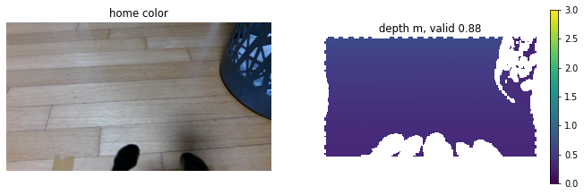
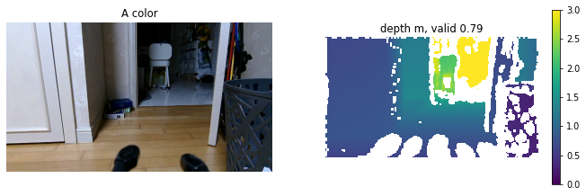
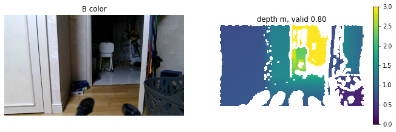

# 방 3D 스캔용 팔 자세 (2026-10-09~10)

디지털 트윈 RGB-D 녹화(`tools/scan/record_room_scan.sh`) 때 쓸 팔 자세. 주행용 홈 자세(카메라가 바닥을 53° 내려다봄)는
벽/가구가 거의 안 보여서 스캔에 맞지 않다. 측정: `tools/perception/home_pose_eval.py <label>`(읽기 전용), 같은 위치·방향,
배터리 10.3~10.4 V. 원본 행은 `scan_pose_20261010.csv`.

| 자세 | 관절 j1..j5 [rad] (실측) | 카메라 높이 | 아래 기울기 | depth 유효 | 바닥 보이는 범위 | LiDAR 유효 |
|---|---|---|---|---|---|---|
| 홈(주행) | 0.004 −0.662 1.663 1.45 0.017 (설정값) | 0.341 m | 53.0° | 0.875 | 0.26~0.78 m | 0.454 |
| A: 손목만 (j4 0.72) | 0.004 −0.658 1.696 0.716 0.017 | 0.426 m | 10.7° | 0.791 | 0.73~1.16 m | 0.454 |
| **B: 팔 세움 (채택)** | 0.008 −0.155 0.327 1.500 0.017 | **0.523 m** | **5.9°** | 0.798 | 0.91 m~ | 0.464 |

- A/B의 `low_frac` 경고(0.25)는 시야에 들어온 슬리퍼·바구니·문 때문이다(바닥 평가용 지표라 스캔 자세에선 의미 없음).
- LiDAR 가림은 세 자세 모두 같다(0.454~0.464): 뒤쪽 160°를 가리는 건 팔 기둥이지 팔 끝 자세가 아니다.
- 수직 시야 약 53°(640×360, hfov 1.446 rad) 기준 위쪽 경계: A는 수평 위 약 15°(3 m 앞에서 높이 약 1.2 m까지),
  B는 약 20°(3 m 앞에서 약 1.6 m까지). **B가 벽·가구를 더 높이까지 담고**, 바닥도 0.9 m 앞부터 보여서 정합에 쓸 수 있다.
- FK 예측과 실측 차이: A는 예측 7.5° → 실측 10.7°(j3가 1.663 대신 1.696에 머문 백래시), B는 예측 4.5° → 실측 5.9°.

## 채택: B
명령값 `joint4 1.5 → joint2 −0.15 → joint3 0.30` 순서(이 순서면 이동 중 카메라 높이 ≥ 0.26 m, FK 확인).
복귀는 역순 `joint3 1.6629 → joint2 −0.6618 → joint4 1.45`. 둘 다 2026-10-10 실기에서 문제없이 이동함.

주의
- 팔을 세우면 무게중심이 높아진다. 스캔 녹화는 0.05~0.08 m/s 텔레옵으로만, Nav2 주행에 쓰지 않는다.
- 이 자세에선 depth 장애물 게이트(홈 자세 판정)가 닫혀 depth 장애물이 꺼진다 — 스캔 중 회피는 사람 몫.

